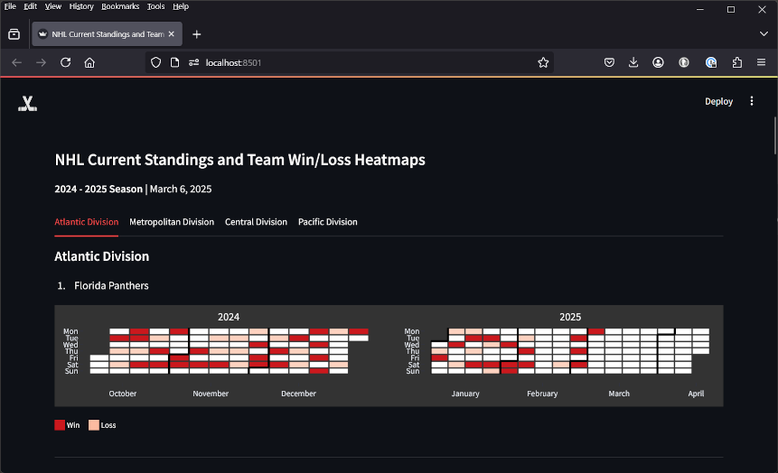

# nhl-standings-cal-heatmap
 

**Live app**: https://nhl-standings-cal-heatmap-cylinderstudio.streamlit.app/

This project is an exercise in Python and utilizing Streamlit, Pandas and Plotly to create calender heatmaps. I'm using an [Unofficial NHL API reference](https://github.com/Zmalski/NHL-API-Reference), and [my fork of a library for Plotly heatmaps](https://github.com/cylinderStudio/plotly-calplot) where I made a few hacks to the visual preferences.

In terms of data, I'm processing the current standings for each NHL division, and displaying them in order. For each team, I plot their losses and wins across their 2024-2025 schedule using custom colorscales. The results are up-to-date as of the current calendar day.